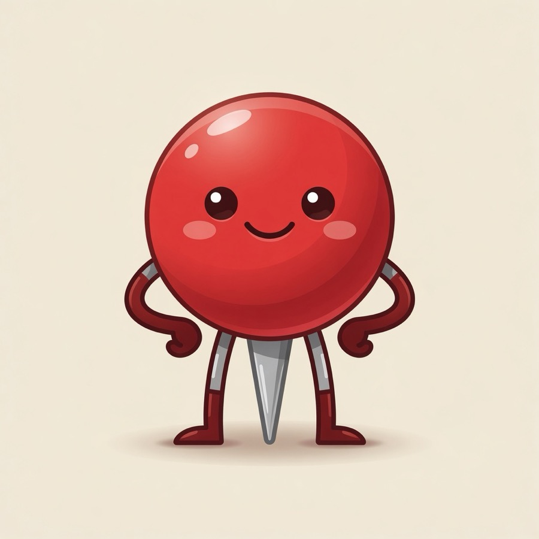
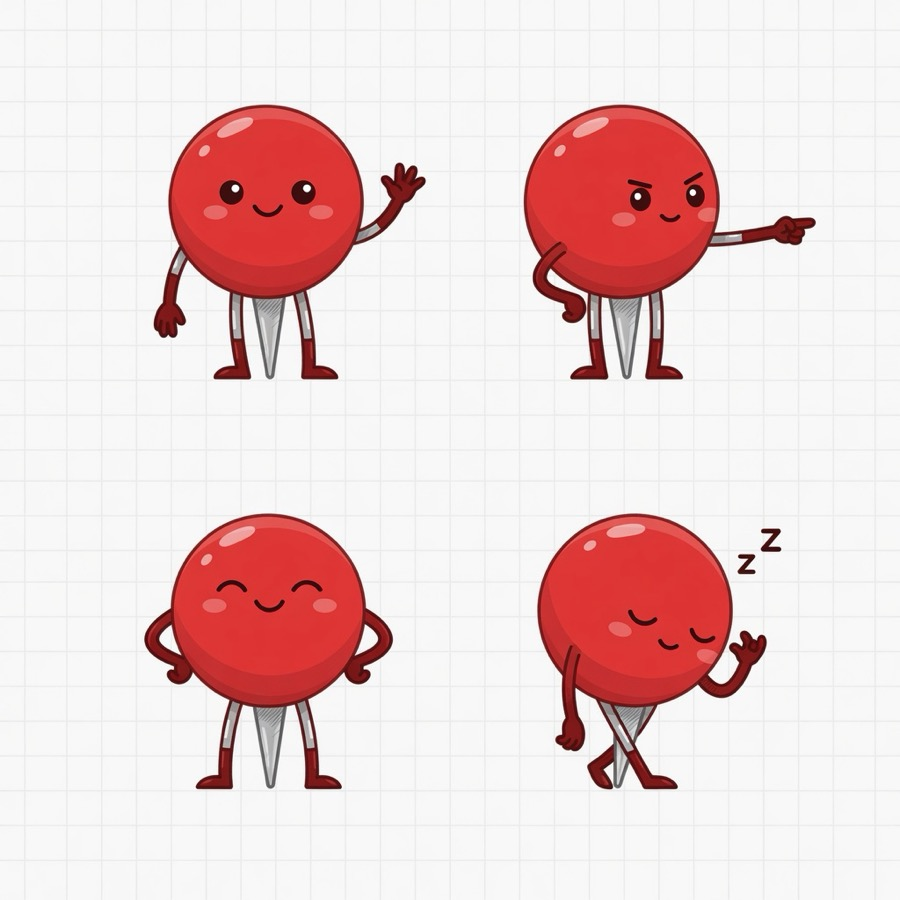
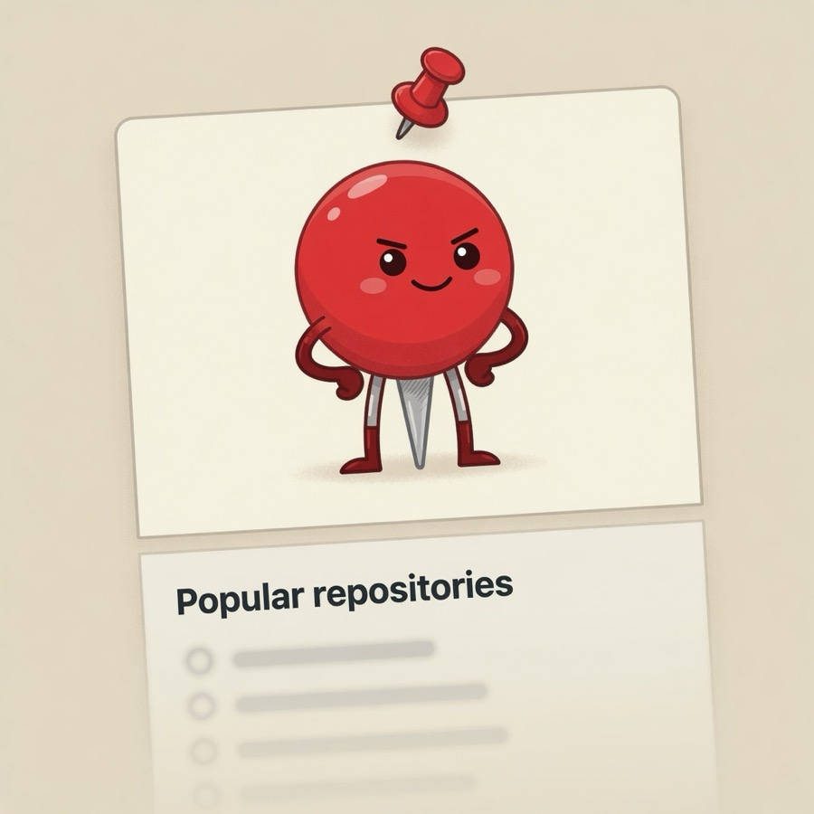
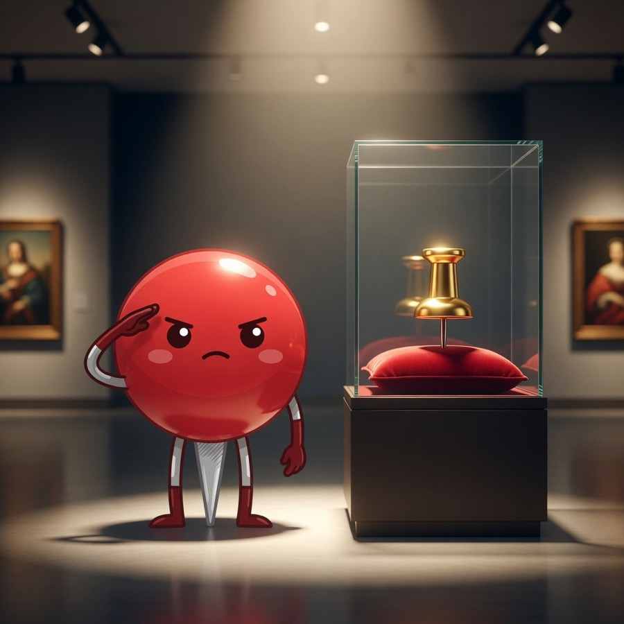
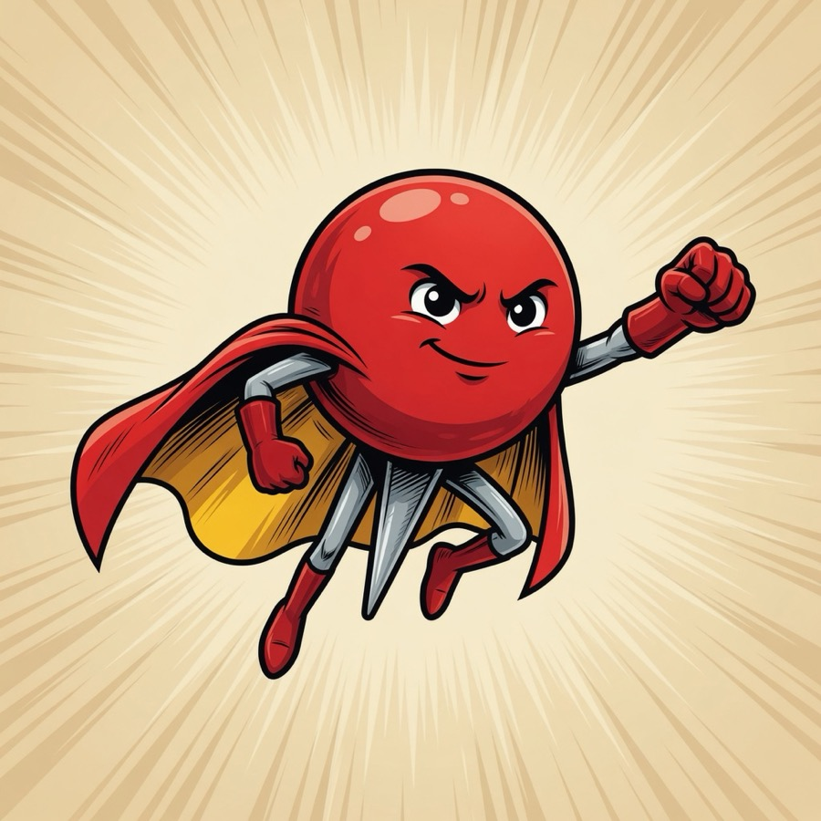
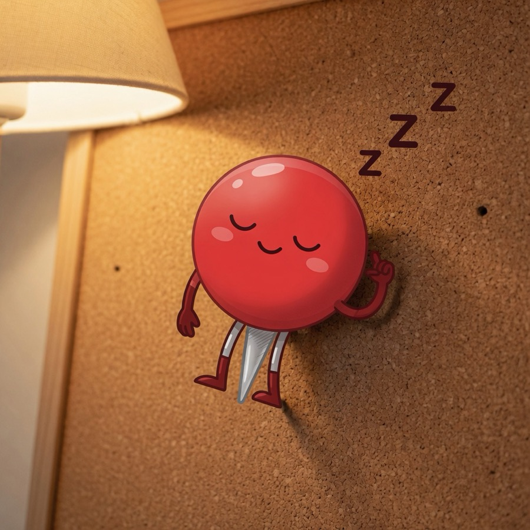
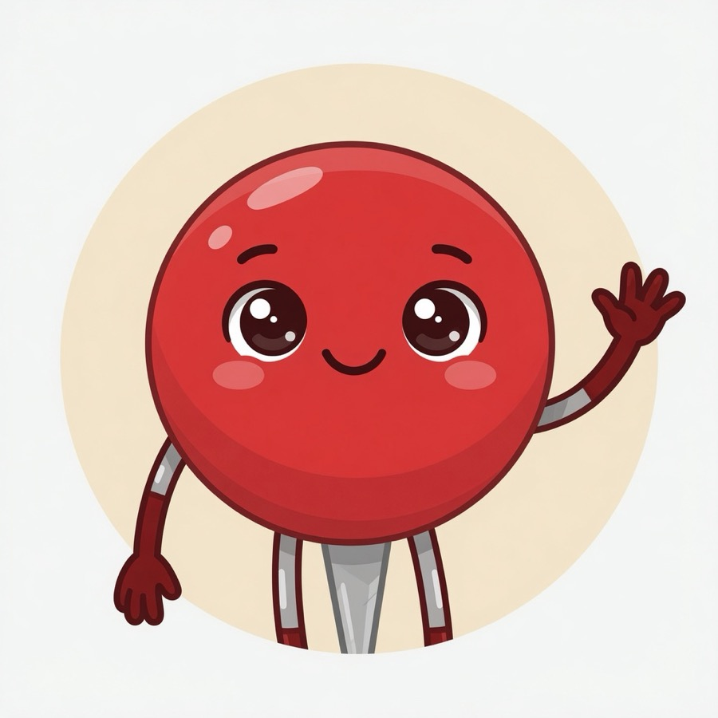
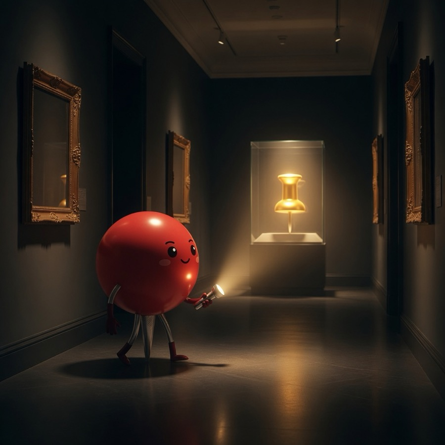

# The Pin Museum

> Meet **Pin** — the only pin on this profile.  
> One character so GitHub stops inventing **Popular repositories**.

---

## Meet Pin

**Pin** is a red pushpin with a face and tiny limbs.  
Job description: stand here. Be the one pin. Occasionally wave.

| Sheet | Profile duty | Museum guard |
|:--:|:--:|:--:|
|  |  |  |

| Education → software | Hero mode | Off duty |
|:--:|:--:|:--:|
|  |  |  |

| Wave | Tour guide |
|:--:|:--:|
|  |  |

### Character shorts

- [Pin waves](videos/06-char-wave.mp4)
- [Pin on profile](videos/07-char-profile.mp4)

<video src="videos/06-char-wave.mp4" controls width="100%"></video>

---

## Character notes (canon, soft)

- Species: *Pinus fixus* (pushpin)
- Color: classic map-pin red head, silver point
- Personality: quiet, proud of being exactly one pin
- Catchphrase candidates: “One is enough.” / “Popular, who?”
- Role: sole profile pin + unofficial museum mascot

---

## Older exhibits (still open)

The non-character gallery and earlier shorts remain in [`gallery/`](gallery/) and [`videos/`](videos/).

### Feature films (museum era)

| # | Clip |
|---|------|
| 01 | [Museum approach](videos/01.mp4) |
| 02 | [Crown pin](videos/02.mp4) |
| 03 | [Cloud pinned to sky](videos/03.mp4) |
| 04 | [Education → software light](videos/04.mp4) |
| 05 | [PIN HARD trailer energy](videos/05.mp4) |

### Permanent collection (24 stills)

| | | |
|:--:|:--:|:--:|
|  |  |  |
|  |  |  |
|  |  |  |
|  |  |  |
|  |  |  |
|  |  |  |
|  |  |  |
|  |  |  |

---

## Why this repo exists

Pin **one** thing → Popular repositories steps aside.  
That one thing is now a character named **Pin**.

No code. No roadmap. Just Pin.

— *The Pin Museum / pin-only*
